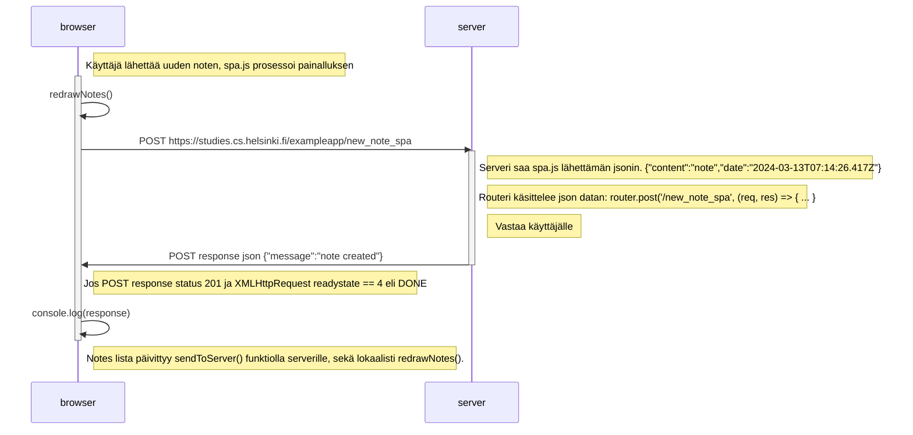

```mermaid
sequenceDiagram
    participant browser
    participant server
    Note right of browser: Käyttäjä lähettää uuden noten, spa.js prosessoi painalluksen
    
    activate browser
    browser->>browser: redrawNotes()
    browser->>server: POST https://studies.cs.helsinki.fi/exampleapp/new_note_spa
    
    activate server
    Note right of server: Serveri saa spa.js lähettämän jsonin.  {"content":"note","date":"2024-03-13T07:14:26.417Z"}
    Note right of server: Routeri käsittelee json datan: router.post('/new_note_spa', (req, res) => { ... }
    Note right of server: Vastaa käyttäjälle
    server ->> browser: POST response json {"message":"note created"} 
    deactivate server
    
    
    Note right of browser: Jos POST response status 201 ja XMLHttpRequest readystate == 4 eli DONE
    browser->>browser: console.log(response)
    deactivate browser

    Note left of server: Notes lista päivittyy sendToServer() funktiolla serverille, sekä lokaalisti redrawNotes(). 
```