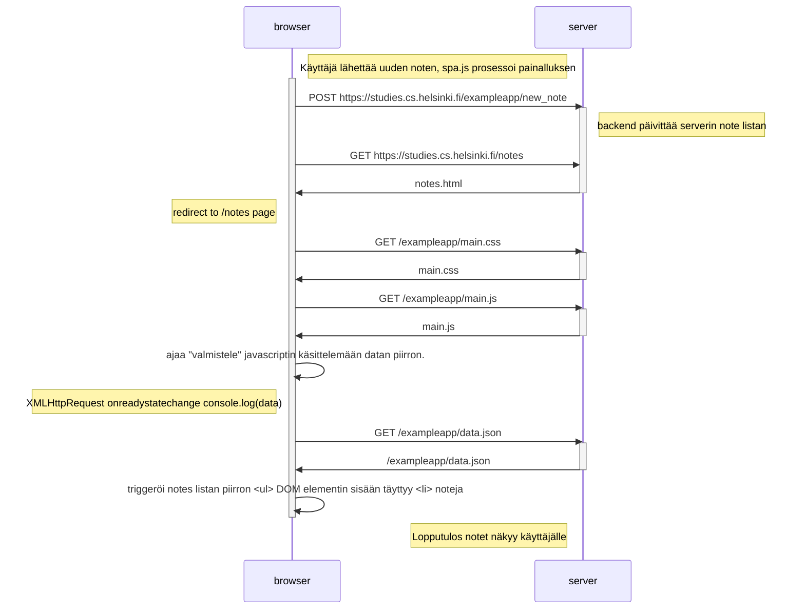

```mermaid
sequenceDiagram
    participant browser
    participant server
    Note right of browser: Käyttäjä lähettää uuden noten, spa.js prosessoi painalluksen
    
    activate browser   
    
    browser->>server: POST https://studies.cs.helsinki.fi/exampleapp/new_note
    activate server
    Note right of server: backend päivittää serverin note listan
    browser->>server: GET https://studies.cs.helsinki.fi/notes
    server->>browser: notes.html
    deactivate server
    Note left of browser: redirect to /notes page
    browser->>server: GET /exampleapp/main.css
    activate server
    server->>browser: main.css
    deactivate server
    browser->>server: GET /exampleapp/main.js
    activate server
    server->>browser: main.js
    deactivate server
    browser->>browser: ajaa "valmistele" javascriptin käsittelemään datan piirron.
    Note left of browser: XMLHttpRequest onreadystatechange console.log(data)
    browser->>server: GET /exampleapp/data.json
    activate server
    server->>browser: /exampleapp/data.json
    deactivate server
    browser->>browser: triggeröi notes listan piirron <ul> DOM elementin sisään täyttyy <li> noteja
    deactivate browser
    Note left of server: Lopputulos notet näkyy käyttäjälle
```