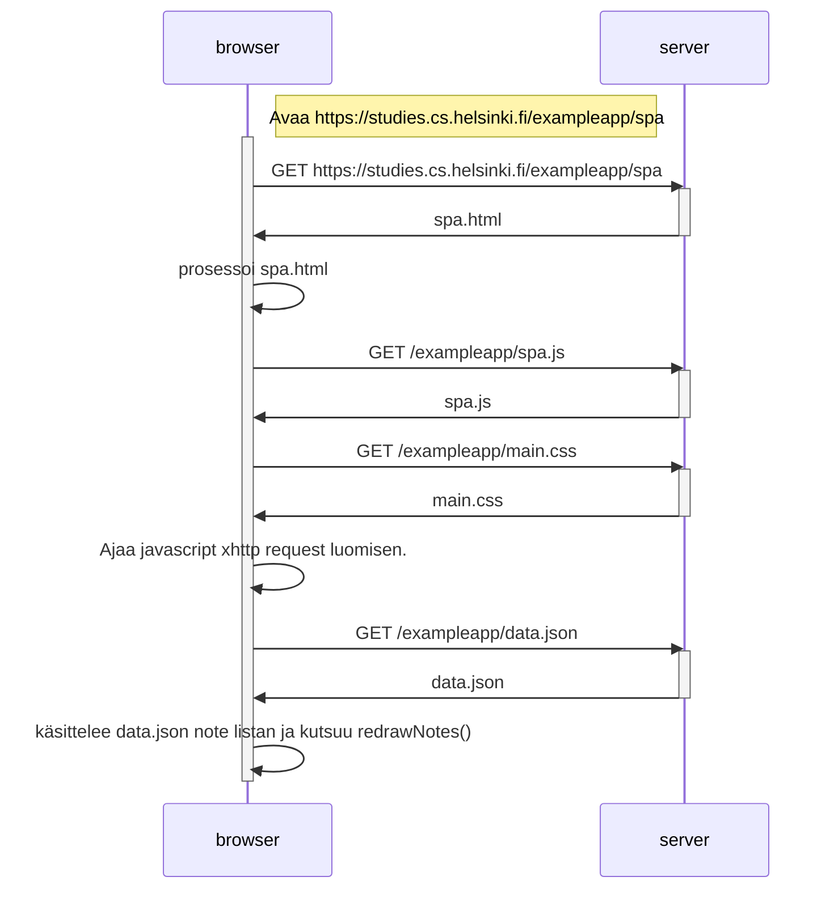

```mermaid
sequenceDiagram
    participant browser
    participant server
    Note right of browser: Avaa https://studies.cs.helsinki.fi/exampleapp/spa
    
    activate browser
    browser->>server: GET https://studies.cs.helsinki.fi/exampleapp/spa
    activate server
    server->>browser: spa.html
    deactivate server
    browser->>browser: prosessoi spa.html
    browser->>server: GET /exampleapp/spa.js
    activate server
    server->>browser: spa.js
    deactivate server
    browser->>server: GET /exampleapp/main.css
    activate server
    server->>browser: main.css
    deactivate server

    browser->>browser: Ajaa javascript xhttp request luomisen.

    browser->> server: GET /exampleapp/data.json
    activate server
    server->> browser: data.json
    deactivate server
    
    browser->>browser: käsittelee data.json note listan ja kutsuu redrawNotes()
    deactivate browser
```